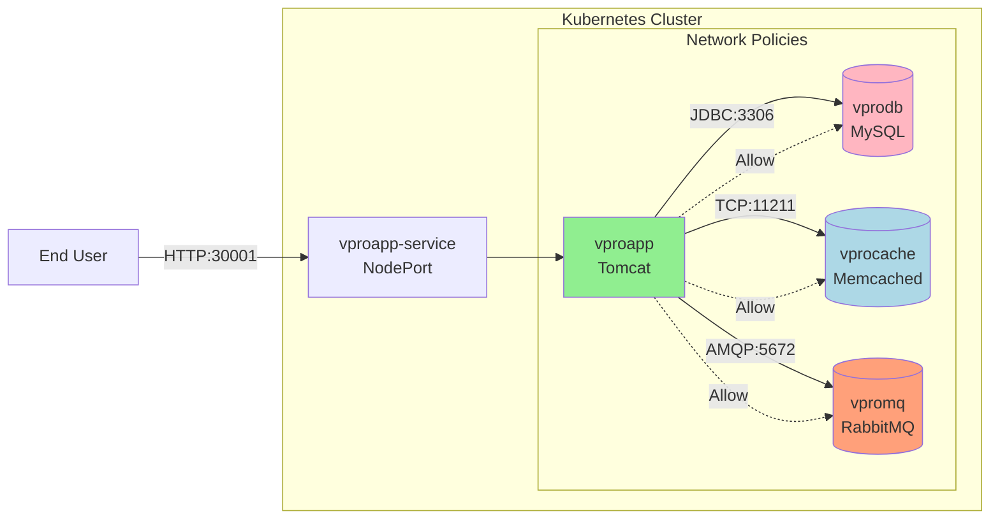
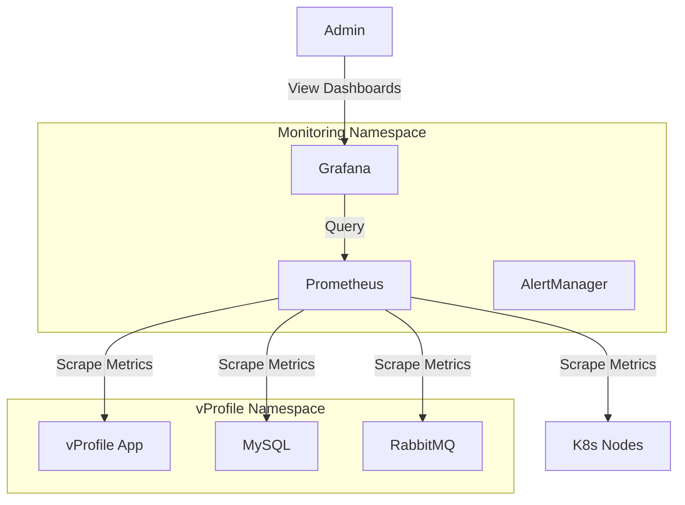

# Architecture Diagrams

## 1. Infrastructure Architecture

This diagram shows the AWS infrastructure setup with 3 EC2 instances forming the Kubernetes cluster.

```mermaid
graph TB
    subgraph "AWS Cloud (us-east-1)"
        subgraph "VPC"
            subgraph "Security Group"
                M[k8s-master<br/>t2.medium<br/>Ubuntu 22.04]
                W1[k8s-worker1<br/>t2.medium<br/>Ubuntu 22.04]
                W2[k8s-worker2<br/>t2.medium<br/>Ubuntu 22.04]
            end
        end
    end
    
    User[DevOps Engineer] -->|SSH (22)| M
    User -->|SSH (22)| W1
    User -->|SSH (22)| W2
    
    M <-->|K8s API (6443)| W1
    M <-->|K8s API (6443)| W2
    
    style M fill:#f9f,stroke:#333,stroke-width:2px
    style W1 fill:#bbf,stroke:#333,stroke-width:2px
    style W2 fill:#bbf,stroke:#333,stroke-width:2px
```

## 2. Application Architecture

This diagram illustrates the vProfile microservices architecture deployed on Kubernetes.



## 3. CI/CD Pipeline

This diagram shows the Jenkins pipeline flow for Continuous Integration and Deployment.

```mermaid
flowchart LR
    Dev[Developer] -->|Push Code| Git[GitHub Repo]
    
    subgraph "Jenkins CI Pipeline"
        Git -->|Trigger| CI[Build & Test]
        CI -->|Lint| Lint[Code Quality]
        Lint -->|Test| Test[Unit Tests]
        Test -->|Build| Docker[Docker Build]
        Docker -->|Scan| Scan[Trivy Scan]
        Scan -->|Push| ECR[AWS ECR]
    end
    
    subgraph "Jenkins CD Pipeline"
        ECR -->|Pull| CD[Deploy]
        CD -->|Ansible| Playbook[Run Playbook]
        Playbook -->|Update| K8s[Kubernetes Cluster]
    end
    
    style CI fill:#FFD700
    style CD fill:#00CED1
```



## 4. Monitoring Architecture

This diagram shows how Prometheus and Grafana monitor the cluster.


